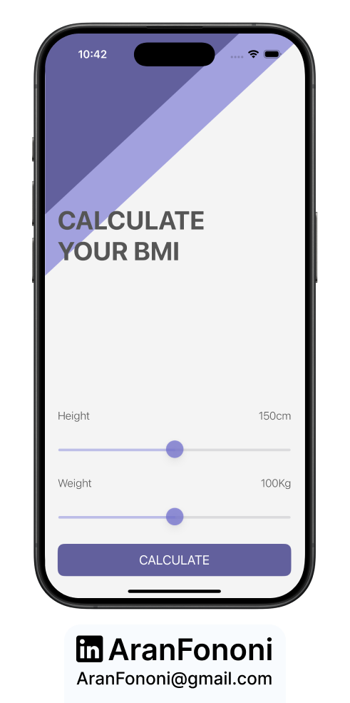
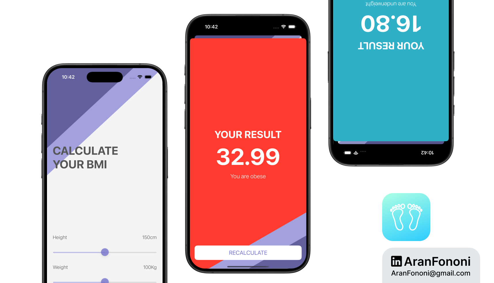

# BMI Calculator

### Project for Section 11: **Multi-Screen App Using Segues**  
This project is from Section 11 of the **Complete iOS Development Bootcamp** by Angela Yu.

## Project Overview
The **BMI Calculator** app allows users to input their weight and height and calculates their BMI, displaying both a result and an advice message based on their BMI score. This app uses multiple screens, with the results displayed on a separate view.

## What I Learned
In this project, I focused on:
- **Segues and Multi-Screen Navigation**: Used segues to navigate between multiple view controllers for a cleaner, modular design.
- **Data Passing Between Controllers**: Leveraged `prepare(for segue:)` to pass calculated BMI data and other parameters from the main screen to the results screen.
- **UISlider for Input**: Employed sliders to let users input their weight and height, updating labels in real-time.

## Key Skills
- Practical understanding of segue navigation
- Data transfer between view controllers
- Dynamic UI elements with `UISlider`

## Additional Features
I included logic in the BMI calculation model to return specific color and advice text based on the BMI range, enhancing the app’s interactivity and feedback.

---

### Project Preview

---

### Footer

---

## Contact
For more information, feel free to reach out:  
- **Email**: [aranfononi@gmail.com](mailto:aranfononi@gmail.com)  
- **LinkedIn**: [Aran Fononi](https://www.linkedin.com/in/aran-fononi-18182b265)
